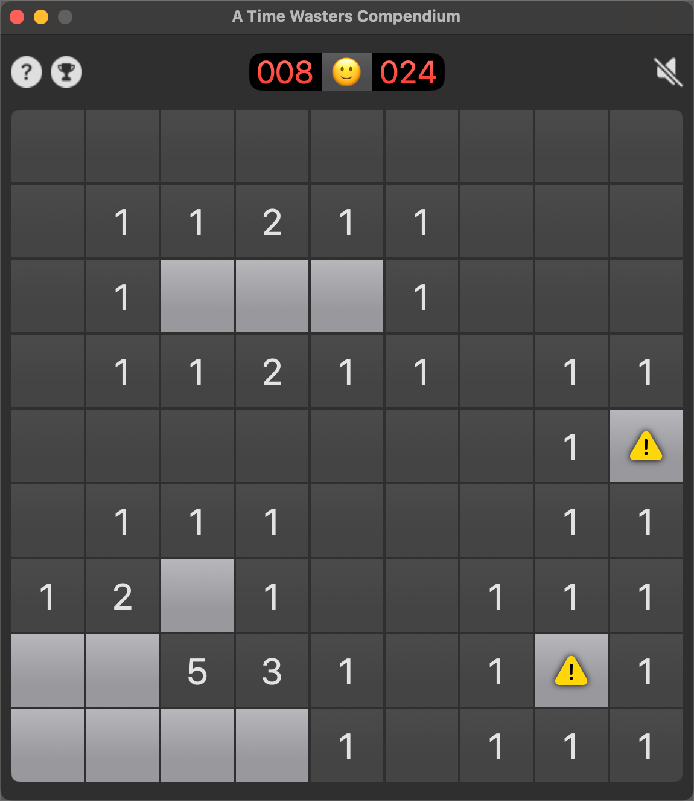
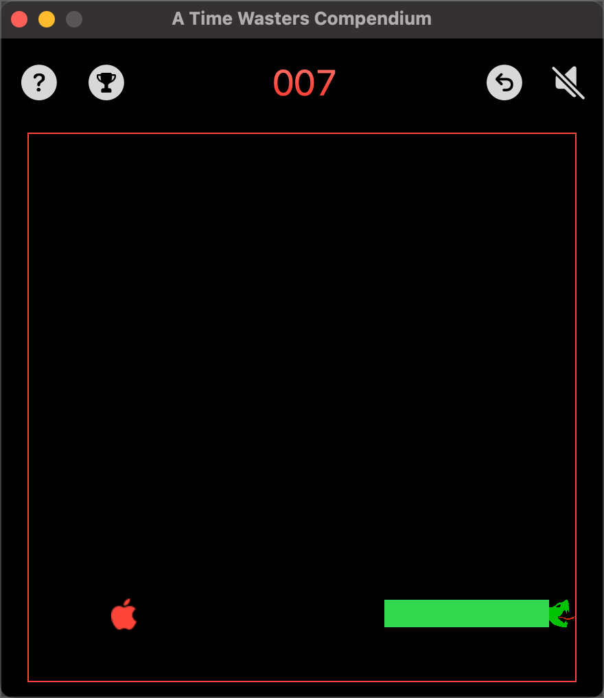

# A Time Wasters Compendium
I've never been one for games on computers. The sad fact is I have arthritis in my thumbs so the moders shoot-em-up games hold little interest for me. That said, there are alternatives that require some level os skill without super-human dexterity.

The purpose of this app is to get some practice in creating simple to play games. The kind of thing we used to play before computers became graphic processing work-horses.

At present, this Mac app contains three games;

* Minesweeper
* WordCraft
* Snake

Minesweeper and WordCraft were created by Paul Hudson in his Hacking With Swift live-streams. I have 'messed' with themto extend the games. Snake is mine.

More will be added at some point. This is just a starter project.

The opening screen animates a button for each game we have created:

If you click on one of the buttons, the game will open.

## Minesweeper

Minesweeper is the classic game from the early days of computing. You are presented with a grid of buttons that hide a number of mines. Your job is to click on a square to clear it without clicking on any of the mines. The game ends when you have identified all of the mines and have cleared all of the non-mine cells.

## WordCraft

Wordcraft is, on the face of it, a simple game. It can, however, be frustratingly difficult. You are given a grid of letters from which you select letters to create words. The twist is that you have to comply with a rule for each word. That may be something as simple as the word has to start with a specific letter or the word has to have an even or odd number of letters.

You also cannot use the same word twice!

## Snake

This is a very old, low res, style of game where you have to move the snake around the board. Your objective is to grow the snake by eating food. Starts out easy, but becomes increasingly complicated as the snake grows. You must remain within the game board and you cannot cross the snake body. If you run into the snake body, you lose the game.

## Overviews

When you hover over the buttons on the home screen, the clock face will change to an information icon. If you click the information icon, you get an overview of the game.

While playing a game, you can get game play instructions by clicking the question mark icon.

Typos to be fixed in review!

