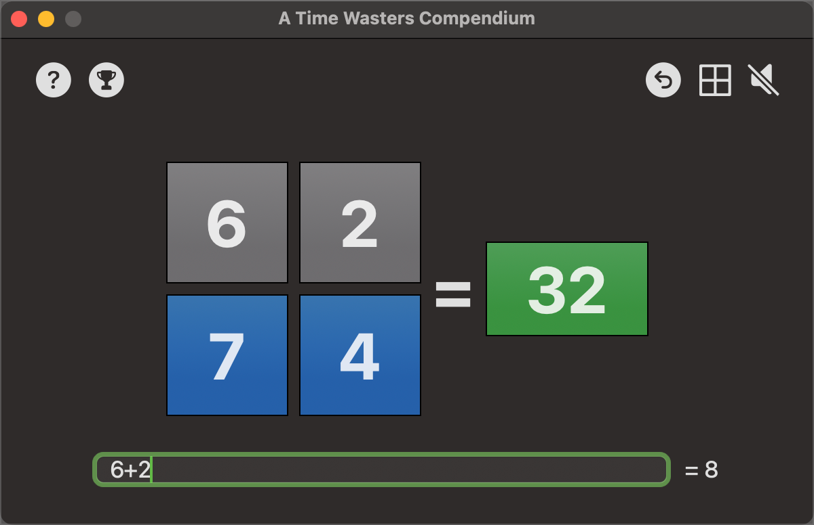

# A Time Wasters Compendium
I've never been one for games on computers. The sad fact is I have arthritis in my thumbs so the moders shoot-em-up games hold little interest for me. That said, there are alternatives that require some level os skill without super-human dexterity.

The purpose of this app is to get some practice in creating simple to play games. The kind of thing we used to play before computers became graphic processing work-horses.

At present, this Mac app contains six games;

* Minesweeper
* WordCraft
* Snake
* Pyramid of Doom
* Number Combinations
* Tic Tac Toe

Minesweeper and WordCraft were created by [Paul Hudson in his Hacking with Swift+ live streams]( https://www.hackingwithswift.com/plus ). I have 'messed' with them to extend the games. Snake, Number Combinations and Tic Tac Toe are mine. Pyramid of Doom is a Stott Adams game from way back when the TRS-80 was still cool - this is my port of that game. 

More will be added at some point. This is just a starter project.

The opening screen animates a button for each game we have created:

If you click on one of the buttons, the game will open.

## Minesweeper

Minesweeper is the classic game from the early days of computing. You are presented with a grid of buttons that hide a number of mines. Your job is to click on a square to clear it without clicking on any of the mines. The game ends when you have identified all of the mines and have cleared all of the non-mine cells.

#### To do?

* I'd like to create a leader board at some stage. Perhaps the best scores at each of the game difficulty levels.

## WordCraft

Wordcraft is, on the face of it, a simple game. It can, however, be frustratingly difficult. You are given a grid of letters from which you select letters to create words. The twist is that you have to comply with a rule for each word. That may be something as simple as the word has to start with a specific letter or the word has to have an even or odd number of letters.

You also cannot use the same word twice!

Since the original development, I have increased the work count from around 60,000 words to over 102,000 words, giving you a getter chance to match a word. It would be very difficult to create a complete word list for all english words, so the 102,000 count is a compromise.

## Snake

This is a very old, low res, style of game where you have to move the snake around the board. Your objective is to grow the snake by eating food. Starts out easy, but becomes increasingly complicated as the snake grows. You must remain within the game board and you cannot cross the snake body. If you run into the snake body, you lose the game.

#### To do?

* Games are separate, so there is no real competitive edge to it. I need to maintain a list of the best 10 scores to give you something to aim for.

## Pyramid of Doom

Decades ago, when I was coding in Z80 assembler on the TRS-80, Scott Adams created some text adventure games. None of your fancy graphics here - you type commands, they get interpreted and the console updates with the results. The original code was written in C and has been stable for a very long time. As far as I know, nothing has happened to it in all that time. 

This is my variant, written in Swift/SwiftUI. It took a long time to translate the original C code to Swift and a lot of debugging to makwe sure I was loading the original game files correctly. The result is Pyramid of Doom:

This is currently a work in progress. It has some minor glitches (such as the game continues when you die!) and it needs some UI changes. However, it is very playable and quite difficult to master at first.

#### To do?

* There are commands to save and restore the game that the user can enter. Right now, these are ignored in favour of using the save and restore icons. I should probably reinstate the command line options.

## Number Combinations

Number Combinations is a pretty straight forward game. Given four numbers and a result, work out the formula you need to generate the result. you must use all four digits and you can use + - * or / operators to achieve the result. You can force the order of calculation using brackets if you need to.

There is an option to display the formula if you're really stuck. 

The main failing of the game at the moment is that divisions are integer divisions so, dividing 3 by 2 results in 1. This isn't ideal and can be used to solve most formulae. I want to address this at some point, but it's not a priority right now.

#### To do?

* It's hard to come up with a scoring system for this one. Best I have come up with is to award points for completing the formula and take points away for giving up and asking for a new puzzle. I need to give this one more thought.
* Game levels. I'm thinking of four levels:
  * Easy - where the game gives you as much time as you like to solve the formula (as it does now)
  * Moderate - where you get a 2 minute count down. If you solve the formula you get points and a new puzzle is generated with a new countdown. If you do not solve the formula, a new one is generated and you lose points.
  * Hard - basically the moderate level but with 1 minute to solve the formula.
  * Very Hard - The Hard level with 30 seconds to solve the formula.
* Game levels also gives me an opening for a scoring mechanism.

## Tic Tac Toe

Better known to some of us oldies as 'Noughts and Crosses', Tic-Tac-Toe is a classic game that has been played for centuries. It is a simple game that can be played by two people or, in our case, one player against a a fiendish computer.

The game is played on a 3x3 grid, and each player takes turns placing their mark in a square. The player who gets three in a row horizontally, vertically, or diagonally wins the game.

The game is simple, but quite hard to win against the AI built into the computer. Can you beat the computer?"

This is a relatively simple game, but includes an AI that calculates the computers move. This is a simplease but very effective AI that leaves just enough space to allow the player to occasionally win. Draw's tend to be the usual result.

Scores are saved across invocations of the app, but can be reset using the reset icon on the tool bar.

## Overviews

When you hover over the buttons on the home screen, the clock face will change to an information icon. If you click the information icon, you get an overview of the game.

While playing a game, you can get game play instructions by clicking the question mark icon.

Typos to be fixed in review!

